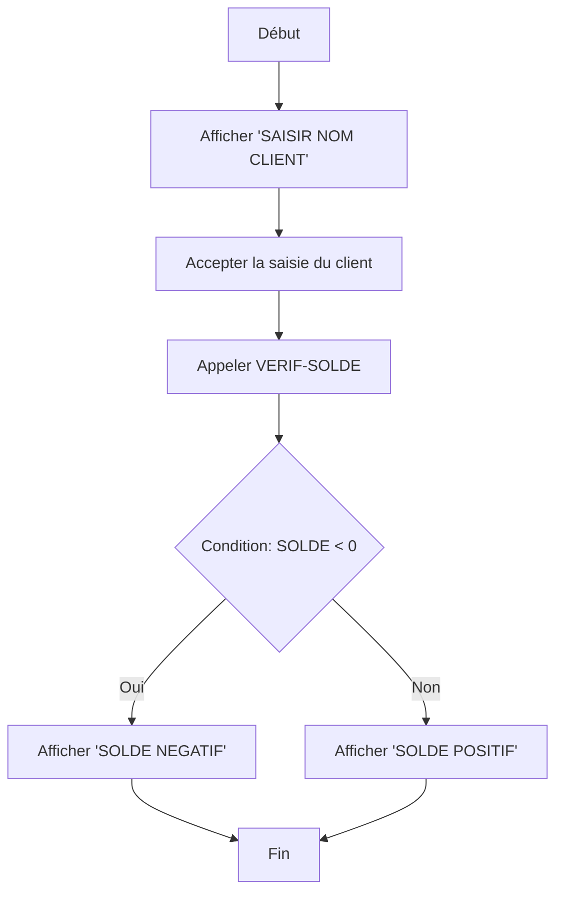

# **🚀 Krobol - Le Langage Condensé pour Moderniser le COBOL**

**Krobol** est un langage **open source**, conçu pour simplifier et moderniser le développement en **COBOL** en réduisant jusqu’à **80 % de la verbosité** du code, tout en conservant toute sa puissance. Il est accompagné d’un **plugin VS Code futuriste**, d’un **transpileur bidirectionnel**, et d’outils pour la **rétrodocumentation automatique** grâce à l’IA.

---

## **📌 Pourquoi Krobol ?**
Le **COBOL** reste un pilier des systèmes critiques (banques, assurances, administrations), mais sa syntaxe verbeuse et son manque de modernité le rendent :
- **Difficile à maintenir** (peu de nouveaux développeurs maîtrisent le COBOL).
- **Coûteux en ressources** (maintenance, documentation manuelle).
- **Peu lisible** (80 % du code est dédié à la syntaxe, pas à la logique métier).

**Krobol répond à ces problèmes** en :
✅ **Condensant le code** (jusqu’à 80 % de caractères en moins).
✅ **Automatisant la rétrodocumentation** via un LLM.
✅ **Offrant une interface moderne** (VS Code + contrôle vocal).
✅ **Permettant une modernisation progressive** sans conversion forcée en Java/C#.

---

## **🔧 Fonctionnalités Clés**
| Fonctionnalité               | Description                                                                                     |
|------------------------------|-------------------------------------------------------------------------------------------------|
| **Transpilation Krobol ↔ COBOL** | Conversion bidirectionnelle pour **moderniser sans perdre l’existant**.                          |
| **Éditeur VS Code**          | Interface modulaire, futuriste, avec coloration syntaxique, autocomplétion et diagrammes.        |
| **Génération de Documentation** | Utilisation d’un **LLM** pour générer une documentation structurée et complète.                |
| **Visualisation des Flux**   | Génération de **diagrammes interactifs** (Mermaid.js) pour comprendre la logique.                |
| **Contrôle Vocal**           | Intégration avec la **Web Speech API** pour piloter l’IDE à la voix.                            |
| **Export Markdown/PDF**      | Export automatique de la documentation vers des formats standards.                             |

---

## **📂 Structure du Projet**
```
krobol/
├── docs/                     # Documentation utilisateur et technique
│   ├── README.md             # Ce fichier
│   ├── CONTRIBUTING.md       # Guide pour contribuer
│   └── TUTORIAL.md           # Tutoriel pas à pas
├── src/                      # Code source du projet
│   ├── transpiler/           # Module de transpilation Krobol ↔ COBOL
│   │   ├── krobolToCobol.ts  # Transpilation Krobol → COBOL
│   │   └── cobolToKrobol.ts  # Transpilation COBOL → Krobol
│   ├── editor/               # Éditeur Krobol pour VS Code
│   │   ├── syntaxes/         # Grammaire Krobol (JSON/ANTLR)
│   │   └── webview/          # Composants UI (React)
│   ├── voice/                # Module de reconnaissance vocale
│   │   ├── voiceCommands.ts  # Gestion des commandes vocales
│   │   └── speechToText.ts   # Intégration API
│   ├── docs/                 # Génération et export de documentation
│   │   ├── llmIntegration.ts # Appel LLM (OpenAI/Local)
│   │   └── export.ts         # Export en Markdown/PDF
│   ├── diagrams/             # Génération de diagrammes
│   │   └── mermaid.ts        # Intégration Mermaid.js
│   └── extension.ts          # Point d'entrée de l'extension VS Code
├── tests/                    # Tests unitaires et d'intégration
│   ├── transpiler.test.ts
│   └── voice.test.ts
├── package.json              # Configuration du projet
├── tsconfig.json             # Configuration TypeScript
└── .github/                  # Fichiers CI/CD et templates
    ├── workflows/
    │   └── test.yml          # Workflow GitHub Actions
    └── ISSUE_TEMPLATE.md    # Modèle pour les issues
```

---

## **🚀 Installation et Utilisation**
### **1. Prérequis**
- **Node.js** (v16+)
- **VS Code** (v1.75+)
- **Compte OpenAI** (si utilisation de l'API externe)
- **Git**

### **2. Installation du Plugin VS Code**
1. **Cloner le dépôt** :
   ```bash
   git clone https://github.com/GoupilJeremy/krobol.git
   cd krobol
   ```
2. **Installer les dépendances** :
   ```bash
   npm install
   ```
3. **Compiler le projet** :
   ```bash
   npm run compile
   ```
4. **Lancer VS Code** et ouvrir le dossier `krobol`.
5. **Appuyer sur `F5`** pour lancer l’extension en mode développement.

### **3. Exemple de Transpilation**
#### **Code COBOL Original**
```cobol
IDENTIFICATION DIVISION.
PROGRAM-ID. EXEMPLE.
DATA DIVISION.
WORKING-STORAGE SECTION.
01 SOLDE PIC 9(5) VALUE 0.
01 CLIENT PIC X(30).
PROCEDURE DIVISION.
DISPLAY 'SAISIR NOM CLIENT'.
ACCEPT CLIENT.
PERFORM VERIF-SOLDE.
STOP RUN.
VERIF-SOLDE.
IF SOLDE < 0
    DISPLAY 'SOLDE NEGATIF'
ELSE
    DISPLAY 'SOLDE POSITIF'
END-IF.
```

#### **Code Krobol Transpilé**
```krobol
ID:EXEMPLE
DATA:
  WS:
    SOLDE:9(5) VALUE 0
    CLIENT:X(30)
PROC:
  DISP:'SAISIR NOM CLIENT'
  ACCEPT:CLIENT
  PERF:VERIF-SOLDE
  STOP RUN
VERIF-SOLDE:
  IF SOLDE<0
    DISP:'SOLDE NEGATIF'
  ELSE
    DISP:'SOLDE POSITIF'
  END-IF
```

#### **Documentation Générée par le LLM**
```markdown
# **Rétrodocumentation : Programme EXEMPLE**

## **Description Générale**
Ce programme demande le nom d'un client et vérifie si son solde est positif ou négatif.

---
## **Variables Utilisées**
| Variable | Type       | Description                     |
|----------|------------|---------------------------------|
| SOLDE    | Numérique  | Solde du compte (5 chiffres)    |
| CLIENT   | Alphanum.  | Nom du client (30 caractères)  |

---
## **Logique Principale**
1. **Affichage et Saisie** :
   - Affiche : `SAISIR NOM CLIENT`
   - Accepte la saisie du nom du client (`CLIENT`).

2. **Vérification du Solde** :
   - Appelle le paragraphe `VERIF-SOLDE`.

3. **Condition sur le Solde** :
   - Si `SOLDE < 0` → Affiche `SOLDE NEGATIF`
   - Sinon → Affiche `SOLDE POSITIF`

---
## **Diagramme de Flux**

```

---

## **🛠️ Développement**
### **1. Ajouter une Nouvelle Grammaire**
1. Éditez le fichier `src/editor/syntaxes/krobol.tmLanguage.json` pour ajouter de nouveaux mots-clés.
2. Testez la coloration syntaxique dans VS Code.

### **2. Étendre le Transpileur**
- Modifiez `src/transpiler/krobolToCobol.ts` pour ajouter de nouveaux cas de transpilation.
- Ajoutez des tests dans `tests/transpiler.test.ts`.

### **3. Intégrer un Nouveau LLM**
- Configurez une nouvelle API dans `src/docs/llmIntegration.ts`.
- Mettez à jour le template de prompt pour le nouveau modèle.

---

## **🤝 Contribution**
Krobol est un projet **open source** et **communautaire** ! Vous pouvez contribuer de plusieurs manières :

### **Issues et Bugs**
- Signalez les bugs ou proposez des améliorations via les [issues GitHub](https://github.com/GoupilJeremy/krobol/issues).
- Utilisez le template **"Bug Report"** ou **"Feature Request"**. 

### **Pull Requests**
1. **Forkez le dépôt** et créez une nouvelle branche :
   ```bash
   git checkout -b feature-votre-nouvelle-fonctionnalite
   ```
2. **Commitez vos changements** :
   ```bash
   git commit -m "Ajout de la fonctionnalité X"
   ```
3. **Poussez la branche** :
   ```bash
   git push origin feature-votre-nouvelle-fonctionnalite
   ```
4. **Ouvrez une Pull Request** sur GitHub.

### **Documentation**
- Améliorez la documentation dans `docs/`.
- Ajoutez des **guides** ou des **tutoriels**. 

### **Traductions**
- Aidez à traduire la documentation dans d’autres langues.

---

## **📜 Licence**
Krobol est distribué sous la **licence MIT** :
- **Autorisé** : Utilisation commerciale, modification, distribution.
- **Obligation** : Inclure la licence et les copyrights dans toutes les copies.

```
Copyright (c) 2026 Jérémy Goupil

Permission is hereby granted, free of charge, to any person obtaining a copy
of this software and associated documentation files (the "Software"), to deal
in the Software without restriction, including without limitation the rights
to use, copy, modify, merge, publish, distribute, sublicense, and/or sell
copies of the Software, and to permit persons to whom the Software is
furnished to do so, subject to the following conditions:

The above copyright notice and this permission notice shall be included in all
copies or substantial portions of the Software.

THE SOFTWARE IS PROVIDED "AS IS", WITHOUT WARRANTY OF ANY KIND, EXPRESS OR
IMPLIED, INCLUDING BUT NOT LIMITED TO THE WARRANTIES OF MERCHANTABILITY,
FITNESS FOR A PARTICULAR PURPOSE AND NONINFRINGEMENT. IN NO EVENT SHALL THE
AUTHORS OR COPYRIGHT HOLDERS BE LIABLE FOR ANY CLAIM, DAMAGES OR OTHER
LIABILITY, WHETHER IN AN ACTION OF CONTRACT, TORT OR OTHERWISE, ARISING FROM,
OUT OF OR IN CONNECTION WITH THE SOFTWARE OR THE USE OR OTHER DEALINGS IN THE
SOFTWARE.
```

---

## **🌟 Roadmap**
| Fonctionnalité               | Statut       | Date Estimée |
|------------------------------|--------------|--------------|
| Version Alpha                | ✅           | Avril 2026   |
| Grammaire Krobol complète    | 🔄           | Juin 2026    |
| Plugin VS Code stable        | 🔄           | Sept 2026    |
| Support des LLM locaux       | 🔄           | Déc 2026     |
| Documentation complète       | 🔄           | Mars 2027    |
| Version 1.0 (stable)         | 🔄           | Juin 2027    |

---

## **📞 Contact**
- **Issues** : [GitHub Issues](https://github.com/GoupilJeremy/krobol/issues)
- **Discussions** : [GitHub Discussions](https://github.com/GoupilJeremy/krobol/discussions)
- **Email** : contact@krobol.dev

---
## **🎉 Rejoignez la Communauté !**
- **Starrez le projet** si vous le trouvez utile ! ⭐
- **Partagez Krobol** avec votre réseau.
- **Contribuez** pour faire évoluer le projet !

---
**🚀 Ensemble, modernisons le COBOL !**