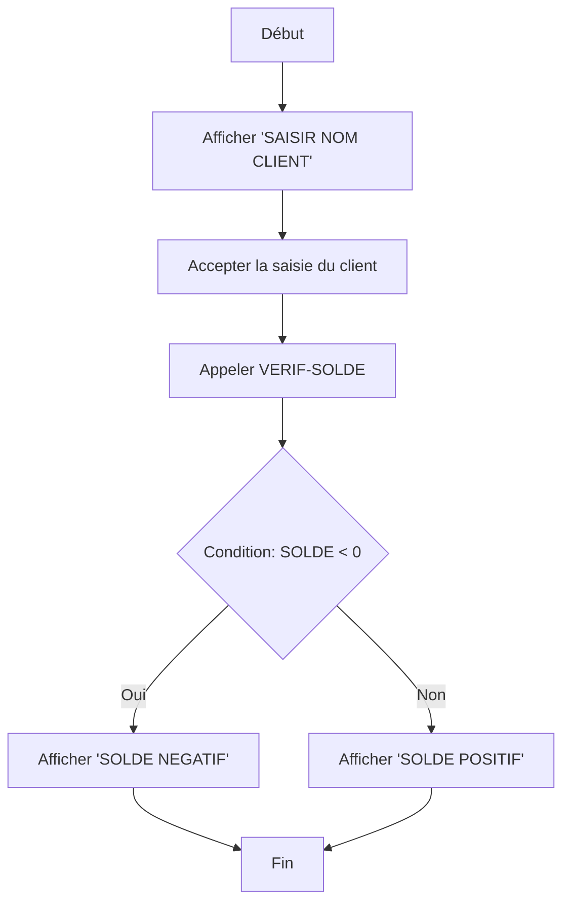
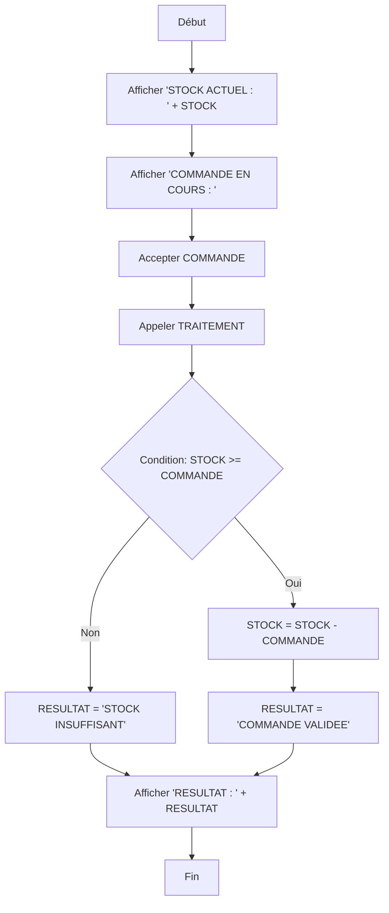

# **📖 Tutoriel Krobol - De COBOL à Krobol en 3 Étapes**

Ce tutoriel vous guide pas à pas pour **transpiler du code COBOL en Krobol**, générer une documentation automatisée, et utiliser le plugin VS Code futuriste.

---

## **⚠️ Prérequis**
- **Node.js** (v16+)
- **VS Code** (v1.75+)
- **Un compte OpenAI** (pour la génération de documentation)
- **Git**
- **Un terminal** (VS Code intégré ou autre)

---

## **🔄 Étape 1 : Transpiler du COBOL en Krobol**

### **1.1. Préparer un Exemple de Code COBOL**
Créez un fichier nommé `exemple.cbl` avec le contenu suivant :

```cobol
IDENTIFICATION DIVISION.
PROGRAM-ID. EXEMPLE.
DATA DIVISION.
WORKING-STORAGE SECTION.
01 SOLDE PIC 9(5) VALUE 0.
01 CLIENT PIC X(30).
PROCEDURE DIVISION.
DISPLAY 'SAISIR NOM CLIENT'.
ACCEPT CLIENT.
PERFORM VERIF-SOLDE.
STOP RUN.
VERIF-SOLDE.
IF SOLDE < 0
    DISPLAY 'SOLDE NEGATIF'
ELSE
    DISPLAY 'SOLDE POSITIF'
END-IF.
```

### **1.2. Installer le Plugin VS Code (si ce n’est pas déjà fait)**
1. Ouvrez VS Code.
2. Allez dans **Extensions** (Ctrl+Shift+X).
3. Recherchez **"Krobol"** et installez-le (ou utilisez le mode développement si vous avez cloné le dépôt).

### **1.3. Transpiler le Code COBOL en Krobol**
1. Ouvrez le fichier `exemple.cbl` dans VS Code.
2. Appuyez sur `Ctrl+Shift+P` pour ouvrir la palette de commandes.
3. Tapez **"Krobol: Transpiler en Krobol"** et validez.
4. VS Code génère un nouveau fichier `exemple.krobol` avec le code suivant :

```krobol
ID:EXEMPLE
DATA:
  WS:
    SOLDE:9(5) VALUE 0
    CLIENT:X(30)
PROC:
  DISP:'SAISIR NOM CLIENT'
  ACCEPT:CLIENT
  PERF:VERIF-SOLDE
  STOP RUN
VERIF-SOLDE:
  IF SOLDE<0
    DISP:'SOLDE NEGATIF'
  ELSE
    DISP:'SOLDE POSITIF'
  END-IF
```

---

## **📝 Étape 2 : Générer la Rétrodocumentation Automatique**

### **2.1. Configurer l’API OpenAI**
1. **Obtenez votre clé API** sur [OpenAI](https://platform.openai.com/account/api-keys).
2. Créez un fichier `.env` à la racine du projet Krobol avec :
   ```env
   OPENAI_API_KEY=votre_clé_api_ici
   ```

### **2.2. Générer la Documentation**
1. Ouvrez le fichier `exemple.krobol` dans VS Code.
2. Appuyez sur `Ctrl+Shift+P` et tapez **"Krobol: Générer la documentation"**. 
3. Le LLM génère automatiquement un fichier `exemple-docs.md` avec le contenu suivant :

```markdown
# **Rétrodocumentation : Programme EXEMPLE**

## **Description Générale**
Ce programme demande le nom d'un client et vérifie si son solde est positif ou négatif.

---

## **Variables Utilisées**
| Variable | Type       | Description                     |
|----------|------------|---------------------------------|
| SOLDE    | Numérique  | Solde du compte (5 chiffres)    |
| CLIENT   | Alphanum.  | Nom du client (30 caractères)  |

---

## **Logique Principale**
1. **Affichage et Saisie** :
   - Affiche : `SAISIR NOM CLIENT`
   - Accepte la saisie du nom du client (`CLIENT`).

2. **Vérification du Solde** :
   - Appelle le paragraphe `VERIF-SOLDE`.

3. **Condition sur le Solde** :
   - Si `SOLDE < 0` → Affiche `SOLDE NEGATIF`
   - Sinon → Affiche `SOLDE POSITIF`

---

## **Diagramme de Flux**

```

---

## **Remarques**
- Aucune exception gérée dans ce programme.
```

---

## **2.3. Visualiser le Diagramme de Flux**
1. Installez l’extension **Mermaid** dans VS Code (si ce n’est pas déjà fait).
2. Ouvrez le fichier `exemple-docs.md` et cliquez sur le diagramme pour le visualiser.

---

## **🎨 Étape 3 : Utiliser le Plugin VS Code Futuriste**

### **3.1. Interface Modulaire**
Le plugin Krobol offre une interface **modulaire et futuriste** avec :
- **Panneau d’édition** : Pour écrire du code Krobol ou COBOL.
- **Panneau de documentation** : Pour voir la rétrodocumentation générée.
- **Panneau de diagrammes** : Pour visualiser les flux.
- **Panneau terminal** : Pour exécuter des commandes.

### **3.2. Contrôle Vocal**
1. Activez le **mode vocal** dans le plugin (icône microphone).
2. Dites des commandes comme :
   - **"Transpiler en Krobol"**
   - **"Générer la documentation"**
   - **"Ouvrir le terminal"**

### **3.3. Personnalisation des Raccourcis**
1. Allez dans **Fichier > Préférences > Raccourcis clavier**.
2. Recherchez **"Krobol"** et personnalisez les raccourcis selon vos besoins.

---

## **🔄 Étape 4 : Transpiler Krobol en COBOL**

Pour revenir au code COBOL original (ou pour l’exécuter sur un mainframe) :
1. Ouvrez le fichier `exemple.krobol`.
2. Appuyez sur `Ctrl+Shift+P` et tapez **"Krobol: Transpiler en COBOL"**. 
3. VS Code génère un fichier `exemple-transpile.cbl` avec le code COBOL original.

---

## **🚀 Exemple Complet : Programme de Gestion de Stock**

### **Code COBOL Original**
```cobol
IDENTIFICATION DIVISION.
PROGRAM-ID. GESTION-STOCK.
DATA DIVISION.
WORKING-STORAGE SECTION.
01 STOCK PIC 9(5) VALUE 0.
01 COMMANDE PIC 9(5) VALUE 0.
01 RESULTAT PIC X(20).
PROCEDURE DIVISION.
DISPLAY 'STOCK ACTUEL : ' STOCK.
DISPLAY 'COMMANDE EN COURS : '. 
ACCEPT COMMANDE.
PERFORM TRAITEMENT.
STOP RUN.
TRAITEMENT.
IF STOCK >= COMMANDE
    SUBTRACT COMMANDE FROM STOCK GIVING STOCK
    MOVE 'COMMANDE VALIDEE' TO RESULTAT
ELSE
    MOVE 'STOCK INSUFFISANT' TO RESULTAT
END-IF.
DISPLAY 'RESULTAT : ' RESULTAT.
```

### **Code Krobol Transpilé**
```krobol
ID:GESTION-STOCK
DATA:
  WS:
    STOCK:9(5) VALUE 0
    COMMANDE:9(5) VALUE 0
    RESULTAT:X(20)
PROC:
  DISP:'STOCK ACTUEL : '→STOCK
  DISP:'COMMANDE EN COURS : '
  ACCEPT:COMMANDE
  PERF:TRAITEMENT
  STOP RUN
TRAITEMENT:
  IF STOCK>=COMMANDE
    MV:STOCK-COMMANDE→STOCK
    MV:'COMMANDE VALIDEE'→RESULTAT
  ELSE
    MV:'STOCK INSUFFISANT'→RESULTAT
  END-IF
  DISP:'RESULTAT : '→RESULTAT
```

### **Documentation Générée**
```markdown
# **Rétrodocumentation : Programme GESTION-STOCK**

## **Description Générale**
Ce programme gère le stock d'un entrepôt. Il vérifie si une commande peut être validée en fonction du stock disponible.

---

## **Variables Utilisées**
| Variable  | Type       | Description                     |
|-----------|------------|---------------------------------|
| STOCK     | Numérique  | Quantité en stock (5 chiffres)  |
| COMMANDE  | Numérique  | Quantité commandée (5 chiffres) |
| RESULTAT  | Alphanum.  | Résultat de la commande         |

---

## **Logique Principale**
1. **Affichage et Saisie** :
   - Affiche le stock actuel.
   - Accepte la quantité commandée.

2. **Traitement** :
   - Si `STOCK >= COMMANDE` → Met à jour le stock et valide la commande.
   - Sinon → Affiche "STOCK INSUFFISANT".

---

## **Diagramme de Flux**

```

---

## **Remarques**
- Aucune gestion d'erreur avancée dans cet exemple simplifié.
```

---

## **📌 Conseils pour Aller Plus Loin**
1. **Étendre Krobol** : Ajoutez des mots-clés pour gérer des cas spécifiques (ex: `CALL`, `OPEN FILE`).
2. **Automatiser la Rétrodocumentation** : Utilisez un script pour générer de la documentation pour tous les fichiers `.krobol` d’un projet.
3. **Intégrer des LLM Locaux** : Pour réduire les coûts, utilisez des modèles open source comme Mistral ou Llama.
4. **Créer des Templates** : Définissez des templates pour des programmes COBOL récurrents (ex: paie, facturation).

---

## **💡 Astuces**
- **Sauvegardez vos fichiers** régulièrement.
- **Utilisez le contrôle vocal** pour gagner en productivité.
- **Partagez vos retours** sur [GitHub Discussions](https://github.com/GoupilJeremy/krobol/discussions) pour améliorer Krobol.

---

## **🎉 Félicitations !**
Vous avez maintenant toutes les clés pour utiliser Krobol et moderniser vos programmes COBOL.

**🚀 Ensemble, faisons du COBOL un langage du futur !**